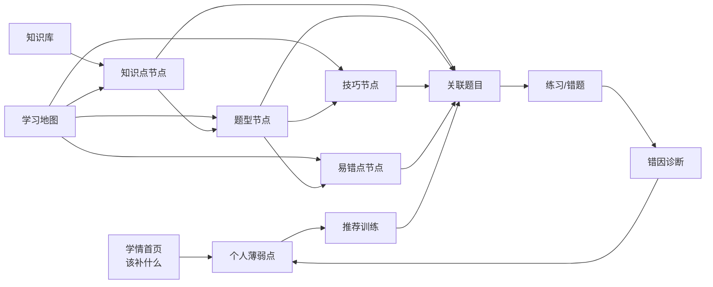

# 学习地图 v2：图谱页产品化

> 专题方案 · 创建于 2026-05-30 · 隶属总设计 `PLAN.md`（§3.1 图谱心智 / §5.1 实体关系 / §7.3 图谱 API / §9 视图表）
> 跟进见同目录 [`PROGRESS.md`](./PROGRESS.md)

## 1. 背景与问题

当前「图谱」页本质是一个**题型单实体浏览器**，不是图谱，存在三类产品问题：

1. **四类节点只暴露两类，且只有一类可浏览。** 知识点/题型/技巧/易错点在 `PLAN §5.1` 都是一等节点，
   但图谱页：题型能浏览、知识点只是侧栏数字、技巧与易错点完全不可见（无计数、无入口、无列表）。
2. **用户无从下手。** 页面只有一条扁平「195 个题型」列表 + 一个无实际作用的「局部图谱」按钮，
   既不回答"从哪进"，也不表达四类节点的关系与角色分工。
3. **题型列表辨识度低。** 单一标签 + 卡片堆叠，没有告诉用户"这些是题型"，且与主导航「知识点」Tab 互相打架。

### 数据事实（2026-05-30 实测 `data/math.db`）

| 节点 | 数量 | 现状 |
|---|---|---|
| 知识点 knowledge_points | 56 | 仅侧栏计数，不可点 |
| 题型 question_patterns | 195 | 唯一可浏览列表 |
| 技巧 skills | 151 | 完全不可见 |
| 通用易错点 common_pitfalls | 30 | 完全不可见 |
| 题目 questions | 1661 | 图谱页看不到 |

关键边数据：

| 边 | 数量 | 含义 |
|---|---|---|
| pattern_kp | 459 | 题型↔知识点（有） |
| **pattern_skills** | **0** | **题型↔技巧（空！）** |
| **pattern_pitfalls** | **0** | **题型↔易错点（空！）** |
| question_skills | 1274 | 题目↔技巧（有，技巧实际挂在题目上） |
| question_pitfalls | 189 | 题目↔易错点（有） |
| question_kp | 3728 | 题目↔知识点 |
| question_patterns_map | 199 | 题目↔题型 |

个人数据（决定"薄弱入口"能否做默认）：

| attempts | mistakes | mistake_diagnoses | personal_weaknesses |
|---|---|---|---|
| 3 | 2 | 5 | 4 |

→ 个人数据近乎为空，冷启动期不能直接把"个人薄弱"作为默认首页。

## 2. 目标方向

把「图谱」产品化为 **「学习地图 / 薄弱定位器」**：用户不需要先判断"从知识点还是题型入手"，
系统提供三个自然入口，并把技巧/易错点升为**可见概念**：

1. **我现在该补什么** —— 从个人薄弱进入（行动入口）。
2. **我想复习某个知识点** —— 进入该知识点的局部学习地图。
3. **我想攻克一类题** —— 进入题型地图，看关联知识点/技巧/易错点/训练题。

### 目标信息架构

```
[学情]  [学习地图]  [题库]  [录题]  [练习/错题]  [知识库]
```

- `学情`：默认决策入口，回答"现在最该补什么"（冷启动期降级，见卡点 2）。
- `学习地图`：替代现「图谱」，看知识点/题型/技巧/易错点之间的局部关系。
- `知识库`：原知识点目录浏览。
- `题库`：材料库，非主要决策入口。

### 学习地图页布局（左侧是节点类型切换，不是题型列表）

```
┌────────────────────────────────────────────────────────────┐
│ 学习地图   个人薄弱 N · 知识点 56 · 题型 195 · 技巧 151 · 易错点 30 │
├──────────────────┬─────────────────────────────────────────┤
│ 入口（类型切换）   │ 当前节点：函数单调性    类型：知识点       │
│ ○ 个人薄弱        │ 通常考成： [求单调区间][参数恒成立]…        │
│ ○ 知识点          │ 常用技巧： [定义法][图像转化]…             │
│ ○ 题型            │ 常见易错点：[忽略定义域][端点开闭错误]…     │
│ ○ 技巧            │ 我的薄弱：是否在此暴露                     │
│ ○ 易错点          │ 关联题目：例题 N · 错题证据 M · 推荐训练 K  │
│ 搜索/分组（章节）  │                                          │
└──────────────────┴─────────────────────────────────────────┘
```

右侧无论从哪类节点进入，始终回答同一组问题：
**这是什么？关联哪些知识点/题型/技巧/易错点？我在这暴露薄弱了吗？有哪些证据错题？下一步练什么？**

### 整体关系



## 3. 三个 P0 卡点（必须先于 IA 改造解决）

### 卡点 1：题型↔技巧/易错点 边为空 → 右侧统一面板会是空壳
- 现象：`pattern_skills=0`、`pattern_pitfalls=0`；题型详情页"技巧/通用易错点"永远显示"暂无"（`app.js:915-916`）。
- 根因：导入只建了 题目→技巧/易错点 边，未回连到题型。
- 方案：**用题目边聚合反推** —— 题型下的题目用到哪些技巧/易错点，卷成题型级别的边写入 `pattern_skills` / `pattern_pitfalls`。

### 卡点 2：个人数据近乎为空 → "薄弱默认入口"冷启动空白
- 现象：attempts/mistakes/weaknesses 仅个位数。
- 方案：个人薄弱**作为入口保留，但不做冷启动默认**；错题量低于阈值时默认落到「学习地图/知识库」，
  学情页提示"先练几道再来定位薄弱"；数据攒够后自动切换默认。

### 卡点 3：节点命名脏 → 直接列表化反而更乱
- 现象：题型名大量是「题型03」「题型01」（局部序号，各出现 18 次）；技巧名是讲义小节标题
  「方法技巧45 …」，且混进了「知识点03 内心的向量表示」（类型污染未清净）。
- 方案：**题型/技巧名规范化（去序号前缀、去重、剔除串型）+ 按章节/范围分组**，再做列表化浏览。

## 4. 优先级栈

| 级别 | 任务 | 依赖 | 产出验收 |
|---|---|---|---|
| **P0** | 数据可用层：① 题目边聚合反推 题型↔技巧/易错点 ② 题型/技巧名规范化+分组+清污 ③ 薄弱冷启动兜底规则 | — | `pattern_skills/pattern_pitfalls` 非空；题型/技巧列表名可读；定义阈值 |
| **P1** | IA 重构：图谱→学习地图，左侧五类节点切换，右侧统一面板 | P0 | 任一类型可进，右侧五问有内容 |
| **P2** | 下钻打通：知识点页/题型页"查看图谱"直达该节点局部地图 | P1 | 从知识点点开 = 该点局部地图（非题型列表） |
| **P3** | 题库筛选：加题型/技巧/易错点维度 | P0 | 三个维度可筛出题目 |
| **P4** | 学情闭环：学情默认页 + 薄弱下钻同一地图 + 证据链；推荐训练后置 | P1,P2 | 错题→诊断→薄弱→推荐 闭环可走通 |

## 5. 验收标准（专题完成判据）

- [ ] 四类节点（知识点/题型/技巧/易错点）在学习地图均**可计数、可浏览、可进详情**。
- [ ] 任一节点详情页右侧能展示其关联的其它类节点 + 关联题目（非"暂无"占位）。
- [ ] 从知识点页"查看图谱"打开的是**该知识点的局部地图**，而非全量题型列表。
- [ ] 题库支持按题型/技巧/易错点筛选。
- [ ] 学情页在有足够个人数据时给出"该补什么"，冷启动期有合理降级。

## 6. 决策记录（2026-05-30 设计交接）

| 决策点 | 选定 | 由此引入的新风险/新任务 |
|---|---|---|
| **里程碑范围** | **做到 P4 闭环** | 「推荐训练」后端**从 0 开发**（无现成端点），需先定义推荐召回规则（薄弱→题型/知识点→题目）。与个人数据近空冲突：冷启动期推荐几乎无输入，**P4 必须自带冷启动降级**（无错题时退化为"按章节顺序/高频题型推荐"）。里程碑明显拉长。 |
| **可视化形态** | **真·节点连线图** | 给无构建纯 vanilla JS 引入可视化库 → 定 **走 CDN 引入（保持无构建）**，候选 cytoscape.js。432 个节点不可能全图渲染，**必须做"以当前节点为中心的 N 跳局部子图"**，并定义交互（缩放/拖拽/点击下钻）。这条单独可顶半个 P1。 |
| **命名处理** | **直接改名落库** | `skills.name` 是 UNIQUE 且导入按 name upsert：① 改名必须**同步改导入器的规范化逻辑**，否则下次导入用旧脏名 upsert 出重复节点；② 清洗需**备份 + 留 `old_name→new_name` 映射表**以防误合并；③ 改名可能使原本不同的脏名归并为同一干净名，需处理边的合并去重。 |

### 仍待定（开工前/对应阶段定）
- 薄弱"足够"的阈值（attempts 数 / 覆盖知识点数）——影响 P4 默认页与推荐降级触发线。
- 边聚合：物化进 `pattern_skills/pattern_pitfalls` 还是实时算（设计倾向：物化 + 并进导入管线）。
- 统一节点详情 API：单个多态 `/api/graph/node/{type}/{id}` 还是分类型端点（设计倾向：多态）。
- 类型污染清理（如 skills 里的"知识点03…"）的范围与可逆性。

## 7. Review 修订（2026-05-30 首轮开发后）

首轮开发已交付（commit `e2aa3bd`）。Review 暴露两条需改设计的结论，连同两项新决策记录如下。

### 数据策略决策
| 决策点 | 选定 | 说明 |
|---|---|---|
| **历史数据定位** | **只作参考，不作设计依据** | 现有 DB 是历史脏数据，不让它绑架建模。后续按最新设计**清空 + 从原始素材重新清理导入**。 |
| **命名/污染（原决策"改名落库"作废）** | **导入时规范化 + 展示清洗，重导入作为清理载体** | 既然要重导，无需对历史 195/151 行做一次性改名迁移。`clean_section_title`（导入器）+ `clean_node_name`（读取）已就位；重导后数据产出即干净。**仍需补**：①导入器/清洗剔除 skills 里的"知识点"前缀类污染（当前未处理）②重名节点合并去重。 |

### Finding 1：题型↔技巧/易错点 边的建模（原"题目桥"设计推翻）
- 原设计"题目→技巧/易错点反推"在本数据上只得 **1 条**边；根因是**结构性**的：技巧/题型/易错点来自三份不同讲义，例题互不相交——**重导入也救不活题目桥**。
- 实测两种自动桥：题目桥=1（空）；朴素知识点桥=6917（噪声，平均每题型连 37 个技巧）。两者都不可用。
- **决策：采用「加权知识点桥 Top-N」**——按共享知识点的重合度打分，每个题型只保留 Top-N（建议 N≈5）技巧/易错点，设最低分阈值。全自动、产出可用短清单；方案"导入显式打标 / 题目桥源头交叉打标"作为后续提质，待确认源素材支撑后再上。

### Finding 2：完成判据修订
- "完成"以**产品结果（面板内容覆盖率）**为准，非"函数能跑/测试 ==1"。验收脚本应断言：生产库中 `pattern_skills` 覆盖的题型占比 ≥ 阈值、且每题型边数落在合理区间（不空、不爆）。

### Finding 1 的最终方案：LLM 题目级语义打标（L2）+ 知识点桥兜底

讨论后升级方案（取代"按知识点重合度打分的 Top-N"）：根因是三份讲义的题目互不共享标签，**用 LLM 从源头重建题目级标签来治本**，而非在实体层打补丁。

**架构（两层 + 兜底）**
```
知识点桥  → 候选召回 + 兜底：圈出共享知识点的候选；LLM 失败/低置信时退化用它
   ↓
LLM(L2)  → 题目级重打标：逐题对照固定清单打 题型+技巧+易错点
   ↓
聚合      → 题目桥复活：题型↔技巧/易错点 边由 question_* 边聚合自然产出（即原 P0-1 sync）
```

- **力度＝L2 题目级**：逐题（约 1661 道）阅读题面，对照**固定候选词表**打标。一次投入多处受益：题目桥复活 + 题库（P3）筛选变精准。
- **知识点桥角色＝候选召回 + 兜底**：为 LLM 提供候选范围（把 29445 对收敛到 ~6917）；LLM 失败或低置信时用它兜底，不留空。
- **成本**：~1661 次调用（可批），作为 P0-5 重导入管线的 enrichment 步骤，非实时。

**硬性护栏**
1. **闭集打标**：把现有题型/技巧/易错点清单作为固定候选词表，强制"从清单选或答无"，**禁止发明新标签**。
2. **留出处**：每条 LLM 标签/边存 `source=llm / 模型 / 日期 / 理由 / 置信度`，可审计、可回滚、可重跑。
3. **人审回路**：LLM 产出为"提案"，抽检 + 低置信度复核后再落库。
4. **离线 + 缓存幂等**：离线脚本跑、结果当数据存；源不变不重算；不在 app 启动/每次导入时实时调。

<!-- finding:skill-canonicalization-poc -->
### Finding 4 · 技巧/题型语义归一（LLM concept-card 抽取 + LLM 判同）

> 追加于 2026-05-30。承接 Finding 1（LLM 题目级语义打标）：
> 解决「不同来源（学校/教材/老师）对**同一个技巧**描述不同」时，如何精确提取并归一到
> KG 的同一 canonical 节点。验证脚本：`poc/canonicalize_skill_poc.py`。

### 1. 问题与现状
KG 四类节点 = 知识点 / 题型(`question_patterns`) / 技巧(`skills`) / 易错(`common_pitfalls`)。
当前入库（`scripts/import_20260530_knowledge_graph.py`）是**正则抽标题**：
- `skills.name` 形如 `方法技巧01 利用正、余弦定理解三角形`，`content_md` 全为 None；
- `question_patterns` 里混入了文档名（如 `2026年高一下学期数学考前最后一课（答案版）`）。

后果：**同一技巧来自两个来源 → 两个永不合并的节点**，无定义/别名/向量，无法判同。

### 2. 方案：抽取与链接两段分离
- **抽取**：LLM 把每个技巧/题型/易错读正文（公式经 `omml2latex.py` 转 LaTeX）抽成
  **概念卡**（结构化内核），tool-use 强制 JSON。技巧概念卡字段：
  `canonical_name / name_raw / core_latex / applicable_conditions / conclusion_use /
  related_kp / evidence_excerpt`。
- **链接/归一**：候选**召回**（embedding，限定同一关联知识点域）→ LLM **裁决**
  （喂概念卡内核，判 same / NEW + confidence + reasoning）→ 合并/新建 →
  低置信进 `review_queue` 人工兜底。
- **判同唯一依据 = 数学内核（公式+适用条件+结论），不是措辞/编排。**
  embedding 只负责召回，是否同一由 LLM 比内核定。

### 3. 四类实体「身份键」不同，不能套一个阈值
| 实体 | 身份键 | 归一方式 |
|---|---|---|
| 知识点 | 教材目录（封闭词表，56 个，已在库 + `kp_fts`） | **分类链接**，不发现 |
| 技巧 | 数学内核（公式/操作） | 注册表 + 别名 + LLM 判同 |
| 题型 | 输入特征 + 目标 + 解题套路 | 同上，比解题模式 |
| 易错 | 被否定的错误命题 | 先归纳成错误命题再判同，最依赖 LLM |

### 4. 验证结论（样本：`专题2.3` vs `培优06`，同一技巧「极化恒等式」）
两份不同系列、不同组织（按题型 vs 按知识点四段+三步法）、不同名称
（`极化恒等式及常见公式应用` vs `巧用极化恒等式解决平面向量问题`），但核心公式与几何形式
逐项相同。`claude-opus-4-8` 判定：

```json
{
  "same": true,
  "canonical_name": "极化恒等式",
  "aliases": ["极化恒等式及常见公式应用", "巧用极化恒等式解决平面向量问题"],
  "unified_core_latex": "a·b = ¼(|a+b|²−|a−b|²); 几何形式 AB·AD = AO²−OB²",
  "confidence": 0.98,
  "reasoning": "核心公式逐项一致+同一『中线²−底边半长²』几何形式+适用条件同(共起点向量/中线结构)+作用同(数量积↔长度求值/最值)；名称与编排差异属措辞，不触内核 → 同一技巧。培优06 的『转化思想/三步法/动点化曲为直』为方法细化，并入 strategy。"
}
```

| | 现在（正则抽标题） | 归一后 |
|---|---|---|
| 技巧节点 | 2 个 | **1 个** `极化恒等式` |
| 别名 / 定义 | 无 / None | aliases 收两叫法 / 统一公式+三步法 |
| 证据题 | 分散 | 两份的题挂同一节点 |

裁决器还正确地把培优06 多出的「动点/化曲为直」识别为同一技巧的方法细化，未误判为新技巧。

### 5. 落地改造 TODO
1. schema：`skills/question_patterns/common_pitfalls` 加
   `canonical_name / definition_md / aliases_json / embedding`；知识点用 `content_md/facets` 当锚。
2. 抽取：`import_20260530_knowledge_graph.py` 的正则抽标题 → LLM 概念卡抽取（接 `omml2latex`）。
3. 管线：抽取 → 召回 → LLM 裁决 → 合并/新建 → 低置信入 `review_queue`。
4. 防过度合并验证（**优先**）：加入 `数量积坐标公式` 等近邻技巧，验证裁决器能**区分** 而非全并。
5. 评估：以「应合并/应区分」的金标对量 precision/recall，调召回 K 与裁决阈值。

